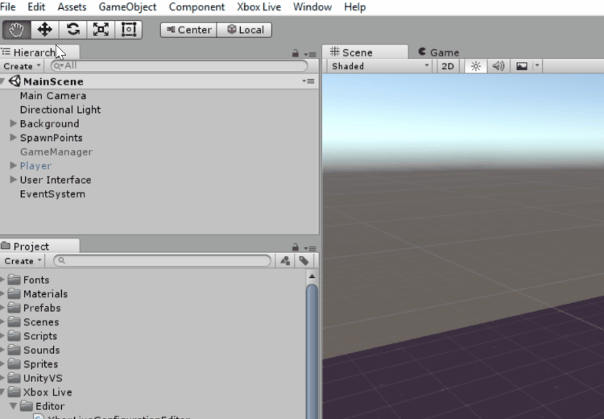
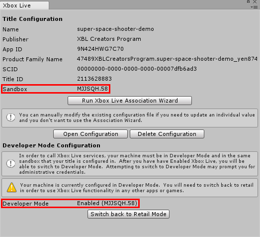
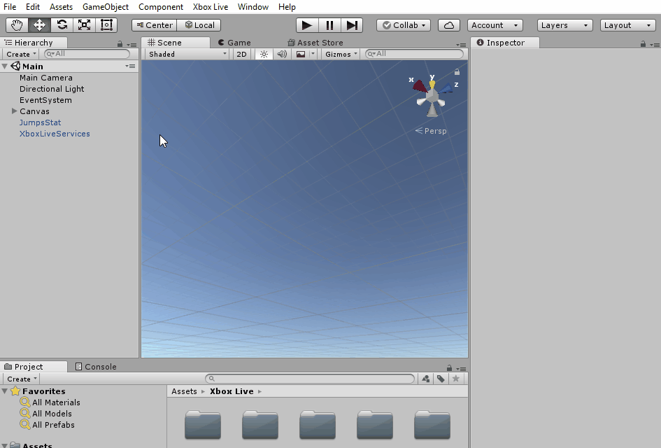

This topic will go through the process of setting up the Xbox Live plugin in Unity.

## Prerequisites
You will need the following before you can use Xbox Live in Unity:

1. **[[Create a Xbox Live enabled title|Pre-coding Preparation]]**.
2. **[Windows 10 Anniversary Update](https://microsoft.com/windows)** or later
3. **[Unity](https://store.unity.com/)** versions **2017.1p5** (or newer), or **2017.2.0f3** (or newer) with **Windows Store .NET Scripting Backend** or **Windows Store IL2CPP Scripting Backend**.
4. **[Visual Studio 2017 15.3.3](https://www.visualstudio.com/)** (or newer) with the **Universal Windows Platform development** workload and **Game Development with Unity** workload.
   > You may deselect the Unity Editor optional component since you'll be installing a newer version of Unity.  
   > If using IL2CPP in Unity, also select the **Desktop development with C++** workload.

## Import the Unity plugin
To import the plugin into your new or existing Unity project, follow these steps:

1. Navigate to the Xbox Live Unity Plugin release tab on [**TODO**](TODO).
2. Download **XboxLive.unitypackage**.
3. In Unity, click **Assets** > **Import Package** > **Custom Package** and navigate to **XboxLive.unitypackage**.

## Set Visual Studio as the IDE in Unity
Visual Studio is required to build a [Universal Windows Platform (UWP)](https://docs.microsoft.com/windows/uwp/get-started/whats-a-uwp) game. You can set your IDE in Unity to Visual Studio by going into **Edit** > **Preferences** > **External Tools** and setting the **External Script Editor** to Visual Studio.

## Enable Xbox Live
For your title to interact with Xbox Live, you'll need to setup the initial Xbox Live configuration. You can do this easily and inside of Unity by using the Xbox Live Association Wizard:

1. In the **Xbox Live** menu, select **Configuration**.
2. In the **Xbox Live** window, select **Run Xbox Live Association Wizard**.
3. In the **Associate Your Game with the Windows Store** dialog, click **Next**, and then sign in with your Dev Center account.
4. Select the app that you want to associate with this project, and then click **Select**. If you don't see it there, try clicking **Refresh**.
5. You will see "This application is already Xbox Live enabled." after checking. If not, please enable Xbox Live service for your title first then try again.
   > For Creators Program, you can also click **Enable** to enable Xbox Live in your title.
6. Click **Continue** to select a Sandbox.
   > For ID@Xbox developers, please make sure you are selecting the same Sandbox as which your Xbox Live configuration has published to.
7. Click **Finish** to save your configuration.

To call Xbox Live services, your desktop must be in developer mode and set to the same sandbox as your title is in the Xbox Live configuration. You can verify both by looking at the **Xbox Live Configuration** window in Unity:

1. **Developer Mode Configuration** should say **Enabled**. If it says **Disabled**, click **Switch to Developer Mode**.
2. **Title Configuration** > **Sandbox** should have the same ID as **Developer Mode Configuration** > **Developer Mode**. If not, click **Switch to Developer Mode**.

   

## Build and test the project
You can build the UWP project in Unity by following these steps:
      
1. Open the **Build Settings** window by selecting **File > Build Settings** or by pressing **Ctrl+Shift+B**.
2. Make sure that you have the scene that you want to test included in your build under **Scenes In Build**. If it's not listed, open the scene and select **Add Open Scenes**.
3. Switch to the **Universal Windows Platform** by selecting **Universal Windows Platform** under **Platform** and clicking **Switch Platform**.  
4. To enable script debugging, check **Unity C# Projects**.
5. Click **Build** and specify the location of the project.  

   

Once the build has finished, Unity will have generated a new UWP solution file which you will need to run in Visual Studio:

1. In the folder that you specified, open **&lt;ProjectName&gt;.sln** in Visual Studio.
2. In the toolbar at the top, select **x64** and deploy to the **Local Machine**.

If you enabled **script debugging** when you built the UWP solution from Unity, then your scripts will be located under the **Assembly-CSharp (Universal Windows)** project.

> Note: Make sure that you are signing into Xbox Live with an authorized test account. These account can be found at [Xbox test accounts](https://developer.microsoft.com/xboxtestaccounts).

## Try out the examples
You're all set to start using Xbox Live in your Unity project! Try opening scenes in the **Xbox Live/Examples** folder to see the plugin in action, and for examples of how to use the functionality yourself.

Try the **SignInAndProfile** scene for signing into your Microsoft Account, the **Leaderboard** scene for creating a leaderboard, and the **UpdateStat** scene for displaying and updating stats.