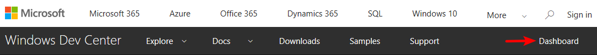
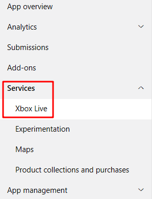
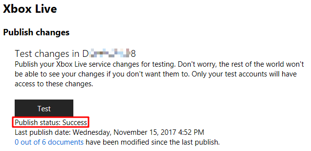

在写任何代码之前，你必须在你的 service configuration portal 上设置一个新的 Title. 你可以在 [Xbox Live Service Configuration](https://docs.microsoft.com/en-us/windows/uwp/xbox-live/xbox-live-service-configuration) 了解更多关于 service configuration 的信息

>如果你对 Xbox Live services 不太熟悉，请阅读 [Xbox Live documentation](https://docs.microsoft.com/windows/uwp/xbox-live).

本节将介绍 **[Windows Dev Center](http://dev.windows.com/)** (也称为通用开发人员中心(Windows Dev Center)(UDC))上配置的 Title 所需的所有内容, 如何创建新项目，以及如何为 Xbox Live 测试做准备。

> Note: 本节重点介绍在Windows开发人员中心进行配置。对于使用 [Xbox Development Portal (XDP)](http://xdp.xboxlive.com/) 的开发人员，请参阅 **TODO **。

## The Creators Program
如果你是 Xbox Live Creators Program 的成员，请按照[Create a new Xbox Live Creators Program title and publish to the test environment](https://docs.microsoft.com/en-us/windows/uwp/xbox-live/get-started-with-creators/create-and-test-a-new-creators-title)中的步骤操作。

如果你已经创建了一个新的 title, 你接下来可以参考 [[Configure Xbox Live in Unity]].

## ID@Xbox program
对 ID@Xbox 开发者来说, 请先按照 [Apply to ID@Xbox](https://www.xbox.com/Developers/id) 执行.一旦应用程序获得批准，您就可以在Windows Dev Center创建一个新的UWP Title.

### 创建新 UWP title
首先，请参考执行 [Windows Dev Center Dashboard](https://developer.microsoft.com/dashboard/) 中的内容.  

接下来，创建一个新的app. 您需要勾选上 **"Create this product in a sandbox"** 并且保存名称。

接下来，会自动跳转至 应用程序的 *App Overview* 页面。Xbox Live 要配置的主要页面位于下方显示的 Services > Xbox Live 菜单下。

### Enable Xbox Live services
当你点击 **Services** 下的 **Xbox Live** 时，你将会看到如下的配置页面。

如果没有，请联系 **TODO** ，提供您的 **Store ID**，您可以在  **App management** > **App identity** > **Store ID** 下找到您的 Store ID.

### 在您的游戏中测试 Xbox Live Service 配置

当您对游戏的Xbox Live配置进行更改时，您需要先将这些更改发布到特定的环境，然后才能被 Xbox Live 的其余部分捕捉，并可以在您的游戏中看到。

#### 将Xbox Live配置发布到测试环境
每当启用Xbox Live服务并对Xbox Live服务配置进行更改时，为使更改生效，您都需要将这些更改发布到开发沙箱。

在Xbox Live配置页上，单击 **Test** 按钮将当前的Xbox Live配置发布到您的开发沙箱。

发布完成后，发布状态将变为“Success”。

#### 为开发环境沙盒创建测试账号
你可以在你的开发沙盒中创建专有的测试账号。你你甚至可以一次创建多个测试账号。请访问 [Creating Test Accounts](https://docs.microsoft.com/en-us/windows/uwp/xbox-live/xbox-live-test-accounts#creating-test-accounts) 以获取更多信息。

### 下一步
现在您拥有一个拥有可用 Xbox Live 的 Title了，接下来您可以参照[[Configure Xbox Live in Unity]].
