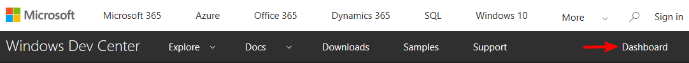
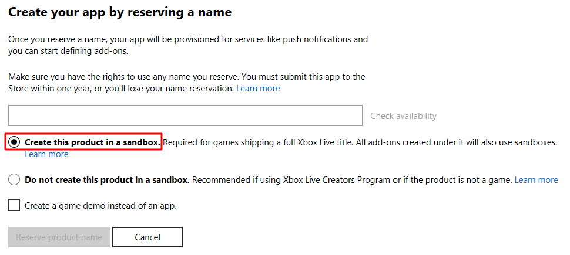
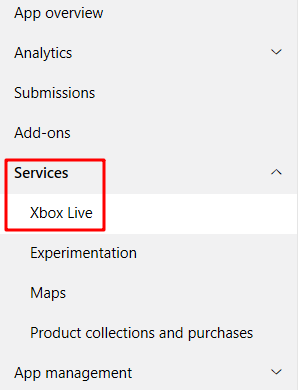
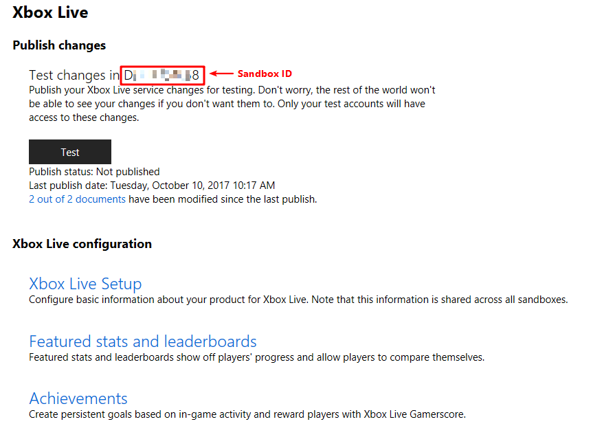
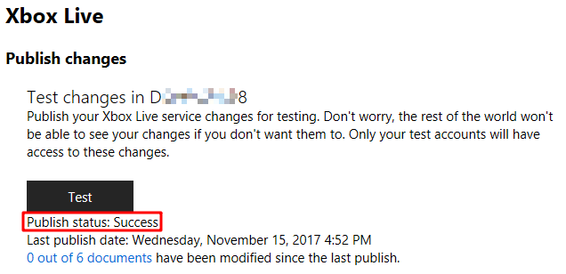

# Pre-coding Preparation

Before writing any code, you must setup a new title on your service configuration portal. You can learn more about service configuration in [Xbox Live Service Configuration](https://docs.microsoft.com/en-us/windows/uwp/xbox-live/xbox-live-service-configuration).

> If you are not familiar with Xbox Live services, please see [Xbox Live documentation](https://docs.microsoft.com/windows/uwp/xbox-live).

This section will walk through everything required to get a title configured on **[Windows Dev Center](https://dev.windows.com/)** (also know as Universal Dev Center (UDC)), a new project created, and preparing Xbox Live for testing.

> Note: This section focus on configuring on Windows Dev Center. For developers who are using [Xbox Development Portal (XDP)](https://xdp.xboxlive.com/), please refer to **TODO**. 

## The Creators Program
If you are part of the Xbox Live Creators Program, please follow the steps in [Create a new Xbox Live Creators Program title and publish to the test environment](https://docs.microsoft.com/en-us/windows/uwp/xbox-live/get-started-with-creators/create-and-test-a-new-creators-title).

Once you have a new title created, you can then [[Configure Xbox Live in Unity]].

## ID@Xbox program
For ID@Xbox developers, you will [Apply to ID@Xbox](https://www.xbox.com/Developers/id) first. Once the application is approved, you can then create a new UWP title on Windows Dev Center.

### Create a new UWP title
You do that by first going to the [Windows Dev Center Dashboard](https://developer.microsoft.com/dashboard/).  

Next, create a new app. You'll need to reserve a name with checking **"Create this product in a sandbox"**.  

You'll then be taken to the *App Overview* page for your app. The primary page where you'll be configuring Xbox Live is under the Services > Xbox Live menu shown below.  

### Enable Xbox Live services
When you click the **Xbox Live** link under **Services**, you will be able to see the configuration page like the following.  

If not, please contact **TODO** with your **Store ID**, you can find the Store ID at **App management** > **App identity** > **Store ID**.

### Test Xbox Live service configuration in your game
When you make changes to the Xbox Live configuration for your game, you need to publish the changes to a specific environment before they are picked up by the rest of Xbox Live and can be seen by your game.

#### Publish Xbox Live Configuration to the test environment
Whenever you enable Xbox Live services and make changes to Xbox Live service configuration, to make the changes effective, you need to publish these changes to your development sandbox.

On the Xbox Live configuration page, click the **Test** button to publish the current Xbox Live configuration to your development sandbox.

Once the publish is done, publish status will turn to "Success".  

#### Create Test Accounts for the development sandbox
You can create test accounts exclusively for use in your development sandboxes. You can also create multiple test accounts at once. For more info, please see [Creating Test Accounts](https://docs.microsoft.com/en-us/windows/uwp/xbox-live/xbox-live-test-accounts#creating-test-accounts).

### Next step
Now you have a full Xbox Live enabled title, you can then [[Configure Xbox Live in Unity]].